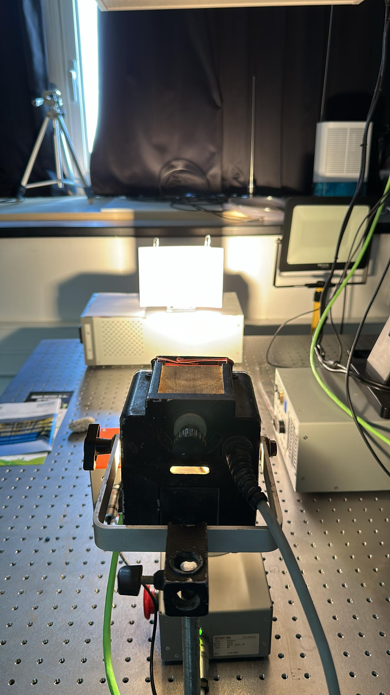

# Geo-engineering Characterization of Quarrying Materials using Hyperspectral Imaging

## Project Overview

This repository presents **models for characterizing the mechanical properties of rocks** using **hyperspectral imaging and machine learning techniques**. The goal is to provide a fast and cost-effective alternative to traditional laboratory methods used in civil engineering and mining applications.

The project was conducted as part of a B.Sc. graduation project in Electrical and Computer Engineering.

---

## Objectives

- Replace slow and expensive lab-based rock analysis with a hyperspectral AI-based pipeline.
- Extract dense spectral data using the **Specim FX10** camera.
- Calibrate and process hyperspectral images.
- Train regression models to predict:
  - Compressive strength (UCS)
  - Density
  - Water absorption

---

## Dataset
- **Source:** hyperspectral images were acquired in a controlled remote sensing lab using a SPECIM FX10 camera.
- **Spectral Range:** 400 nm – 1000 nm across 448 bands.
- **Image Size:** 1024 × 225 pixels (uint16).
- **Samples:** 102 different rock samples with mechanical property labels obtained through standard IS3 tests.

  
  
  

---

## Project Structure
- Imaging
- Image Processing
- Machine learning

  

---

## Tools and Methods

- **Hyperspectral Camera** - Specim FX10  

  

> Source: [www.specim.com](https://www.specim.com/products/specim-fx10/#)

- **Image Calibration**
  - Dark frame subtraction
  - White reference normalization

  
  

- **Preprocessing**
  - Spectral denoising using Polynomial fitting (polyfit)

  

  - Wavelet transform for multiscale analysis

  
  
  

  
  - Spectral slope & curvature

- **Clustering**
  - Unsupervised pixel segmentation using **K-Means**

- **Machine Learning**
  - Feature extraction
  - Training with:
    - Random Forest Regressor
    - Neural Networks (MLP)

---

## Results

| Target Property     | MAE   | R² Score |
|---------------------|-------|----------|
| Water Absorption    | ~1.1  | 0.93     |
| UCS (Strength)      | ~8.6  | 0.91     |
| Density             | ~0.14 | 0.89     |

---

## Authors

- **Dolev Dahan**  
- **Tal Dayan**  

Supervised by:  
**Dr. Yitzhak August**  
**Dr. Dagan Bakon**

> Sami Shamoon College of Engineering  
> Department of Electrical and Computer Engineering

---

## License

This project is released for academic and research purposes.
