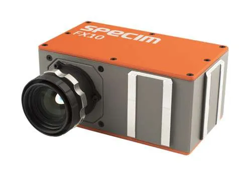

# Geo engineering characterization of quarrying materials using a hyperspectral camera

A MATLAB-based project for analyzing hyperspectral data of quarrying materials, using image processing, feature extraction, and deep learning.
The final objective is to predict geomechanical properties, including UCS, porosity, and water absorption.
The project aims to assist mining and civil engineering industries in evaluating rock quality rapidly and cost-effectively.

## Dataset
The dataset used in this project is **private** and was acquired using a **Specim FX10 hyperspectral camera** in a controlled laboratory environment at the Remote Sensing Lab.

## Hyperspectral Camera

### 📷 Specim FX10  

> Source: [www.specim.com](https://www.specim.com/products/specim-fx10/#)

The **Specim FX10** is a high-performance hyperspectral camera that operates in the **visible to near-infrared (VNIR)** range, covering wavelengths from **400 nm to 1000 nm**. It captures detailed spectral information at each pixel, enabling precise material identification and surface analysis.

In this project, the FX10 was used to capture hyperspectral images of rock slabs in a laboratory environment under controlled lighting and calibration. The resulting data provided hundreds of spectral bands per image, which were later used to train AI models for predicting geomechanical properties.

### 🔧 Key Specifications:
- **Spectral range:** 400–1000 nm  
- **Spectral bands:** 224 (expandable up to ~330)  
- **Spectral resolution:** ~5 nm  
- **Spatial resolution:** 1024 pixels per line  
- **Frame rate:** Up to 330 Hz  
- **Output format:** ENVI (.hdr + .raw), TIFF

This camera is commonly used in fields such as **geology, agriculture, quality control, and remote sensing**, and plays a central role in enabling **non-destructive rock property prediction** in this study.

# Geo-engineering Characterization of Quarrying Materials using Hyperspectral Imaging

## Project Overview

This repository presents **models for characterizing the mechanical properties of rocks** using **hyperspectral imaging and machine learning techniques**. The goal is to provide a fast and cost-effective alternative to traditional laboratory methods used in civil engineering and mining applications.

The project was conducted as part of a B.Sc. graduation project in Electrical and Computer Engineering.

---

## Objectives

- Replace slow and expensive lab-based rock analysis with a hyperspectral AI-based pipeline.
- Extract dense spectral data using the **Specim FX10** camera.
- Calibrate and process hyperspectral images.
- Train regression models to predict:
  - Compressive strength (UCS)
  - Density
  - Water absorption

---

## Dataset
- **Source:** hyperspectral images were acquired in a controlled remote sensing lab using a SPECIM FX10 camera.
- **Spectral Range:** 400 nm – 1000 nm across 448 bands.
- **Image Size:** 1024 × 225 pixels (uint16).
- **Samples:** 102 different rock samples with mechanical property labels obtained through standard IS3 tests.

---

## 🛠️ Tools and Methods

- **Hyperspectral Camera** - Specim FX10

  

> Source: [www.specim.com](https://www.specim.com/products/specim-fx10/#)

- **Image Calibration**
  - Dark frame subtraction
  - White reference normalization

- **Preprocessing**
  - Spectral denoising using Polyfit
  - Wavelet transform for multiscale analysis
  - Spectral slope & curvature

- **Clustering**
  - Unsupervised pixel segmentation using **K-Means**

- **Machine Learning**
  - Feature extraction
  - Training with:
    - Random Forest Regressor
    - Neural Networks (MLP)

---

## Project Structure

- `data/` – **Private dataset** containing raw hyperspectral rock images and lab results
- `calibration/` – Scripts for radiometric and geometric image calibration  
- `preprocessing/` – Feature extraction using Polyfit, wavelets, and K-means clustering  
- `models/` – Pretrained machine learning models for regression  
- `notebooks/` – Jupyter notebooks for visualization, training, and evaluation  
- `images/` – Project-related illustrations and figures for documentation  
- `README.md` – Project description and usage guide

---

## 📈 Results

| Target Property     | MAE   | R² Score |
|---------------------|-------|----------|
| Water Absorption    | ~1.1  | 0.93     |
| UCS (Strength)      | ~8.6  | 0.91     |
| Density             | ~0.14 | 0.89     |

> Visual correlation plots between ground truth and predictions are available in the `notebooks/` directory.

---

## Authors

- **Dolev Dahan**  
- **Tal Dayan**  

Supervised by:  
**Dr. Yitzhak August**  
**Dr. Dagan Bakon**

> Sami Shamoon College of Engineering  
> Department of Electrical and Computer Engineering

---

## License

This project is released for academic and research purposes.

