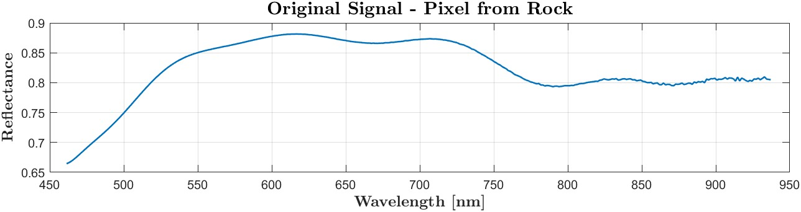

# Geo-engineering Characterization of Quarrying Materials using Hyperspectral Imaging

## Project Overview

This repository presents **models for characterizing the mechanical properties of rocks** using **hyperspectral imaging and machine learning techniques**. The goal is to provide a fast and cost-effective alternative to traditional laboratory methods used in civil engineering and mining applications.

The project was conducted as part of a B.Sc. graduation project in Electrical and Computer Engineering.

---

## Objectives

- Replace slow and expensive lab-based rock analysis with a hyperspectral AI-based pipeline.
- Extract dense spectral data using the **Specim FX10** camera.
- Calibrate and process hyperspectral images.
- Train regression models to predict:
  - Compressive strength (UCS)
  - Density
  - Water absorption

---

## Dataset
- **Source:** hyperspectral images were acquired in a controlled remote sensing lab using a SPECIM FX10 camera.
- **Spectral Range:** 400 nm – 1000 nm across 448 bands.
- **Image Size:** 1024 × 225 pixels (uint16).
- **Samples:** 102 different rock samples with mechanical property labels, tested in the Civil Engineering Laboratory using standard and widely accepted methods currently used in the industry.

- **LAB setup:**

  
  
  

- Dataset example can be found [here](https://github.com/DolevDahan/Hyperspectral-Image-Processing/tree/main/dataset%20example)

  

---

## Project Structure
- Imaging
- Image Processing
- Machine learning

  

---

## Imaging
- **Hyperspectral Camera** - Specim FX10

  

> Source: [www.specim.com](https://www.specim.com/products/specim-fx10/#)

- **Image Calibration**
  - Dark frame subtraction
  - White reference normalization

  
  

## Preprocessing
- **Rock Pixel Segmentation and Spectral Edge Removal**
  - Isolating the rock spatial pixels
    

      
    

  - Removing spectral edge data due to low intensity near 400 nm and 1000 nm (spectrum boundaries)
    

      
    

- **Euclidean normalization**
  In order to eliminate magnitude differences between pixel spectra and enable better feature extraction, each pixel vector in the hyperspectral cube was normalized to unit length using 
  
**Formula**

Let **x** be a pixel vector:  
 **x** = [x₁, x₂, ..., xₙ]  

The **Euclidean norm** (L² norm) is defined as:  
 ‖**x**‖₂ = sqrt(x₁² + x₂² + ... + xₙ²)  

The **normalized vector** is:  
 **x̂** = **x** / ‖**x**‖₂

**Implementation Summary:**
- Each pixel in the hyperspectral cube is treated as a vector over the spectral bands.
- For each pixel, we compute its L2 norm and divide the pixel vector by this value.
- A 2D matrix storing the original Euclidean distances is also returned.

- **Denoising**
  - Spectral denoising using Polynomial fitting (polyfit)

  

- **Clustering**
  - Unsupervised pixel segmentation using **K-Means**

- **Feature extraction**
  - Statistical features  
  - Wavelet transform
  

   
   
  

- **Machine Learning**
  - Training with:
    - Random Forest Regressor
    - Neural Networks (MLP)

---

## Results

| Target Property     | MAE   | R² Score |
|---------------------|-------|----------|
| Water Absorption    | ~1.1  | 0.93     |
| UCS (Strength)      | ~8.6  | 0.91     |
| Density             | ~0.14 | 0.89     |

---

## Authors
- **Dolev Dahan**  

Supervised by:  
**Dr. Yitzhak August**  
**Dr. Dagan Bakon**

> Sami Shamoon College of Engineering  
> Department of Electrical and Computer Engineering

---

## License

This project is released for academic and research purposes.
